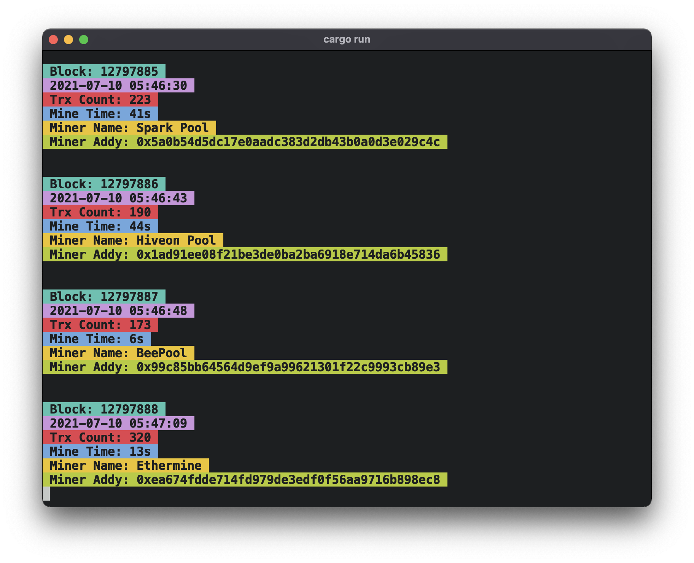

# eblock 🧑‍🎤

<a href="https://crates.io/crates/eblock">
  
</a>



eblock is a way to stream live updates on mined blocks from Ethscan in your shell (addtional pretty colors included).

## Installation

```bash
cargo install eblock
```

## Usage

```bash
eblock
# Blocks will start streaming below
```